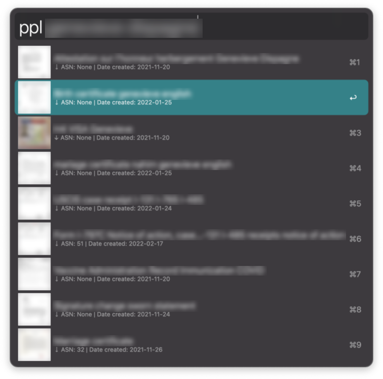

# Description

Alfred workflow integration for the [Paperless-ngx](https://github.com/paperless-ngx/paperless-ngx) document management system. Highlights include:
* Secure token in the [keychain](https://support.apple.com/guide/keychain-access/what-is-keychain-access-kyca1083/mac), no credential storage
* Cache enabled document thumbnail support
* Cache enabled document download/view
  * ⇣ uncached document
  * ↓ cached document

  

# Installation

## From the Github release page
1. Download the workflow in the GitHub releases section. It is a `.zip` file. After extraction, you should find a `.alfredworkflow` to import.
2. Open in finder to import the workflow in Alfred
3. Set up the `PAPERLESS_INSTANCE` environment variable to point to your Paperless installation url. Example: `http://paperless.local:8000/`

## From sources
1. Clone the repo
2. `cd paperless-alfred`
3. `pip3 install -r requirements.txt --target=./`
4. `zip -r paperless-alfred.alfredworkflow .`
5. `open paperless-alfred.alfredworkflow`
6. Go to step 3 from release page installation

# Usage

1. Run `pplc username password` to connect to your Paperless instance. This workflow does not retain your credentials. Instead, it will pull a token from Paperless and store it securely into your keychain.
2. Run `ppl <your search>` to search in your documents
   1. Use the arrow keys or the mouse to select one document and hit `[ENTER]` to view it. The search supports matrix is purely dictated by Paperless[[1](https://docs.paperless-ngx.com/api/#searching-for-documents)]:
        > Only a small subset of filtering parameters are supported.

   2. Once you viewed it once, it's cached on your system, and presented to Alfred as such. Which allows for all the file triggers to take place (copy, move, send, info, ...)

## Considerations
Caching does not mean offline search. The search is handled by Paperless, and the result of the search is used to match a document ID on the local system if present. The paperless instance should be accessible for this workflow to work.

# TODO
* Nice GIF demonstrating the workflow
* All around code cleanup & robustness
* Front-end command dispatcher script
  * Should take the form of what Alfred qualifies as a filter script
  * Call into the proper backend script instead of letting the backend script handle everything
  * Avoids having to register multiple keywords. Ideally people could do:
    * `ppl connect`
    * `ppl purge`
    * `ppl <search terms>` this would likely be implemented in the form of "all the pattern that did not match a command"
